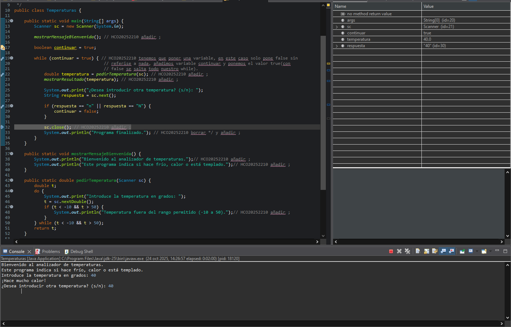
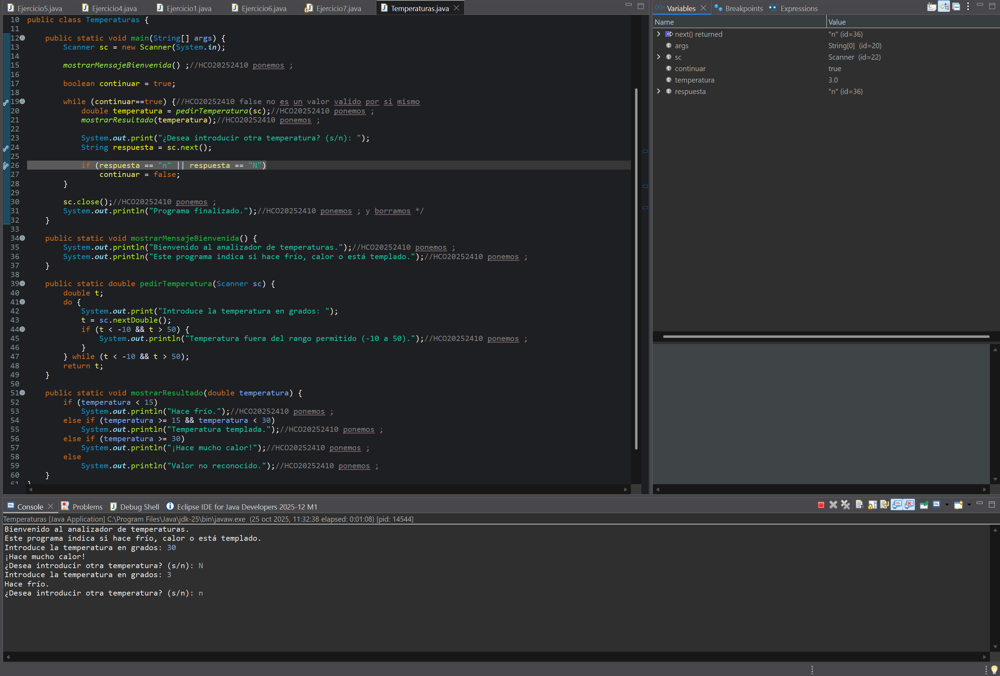
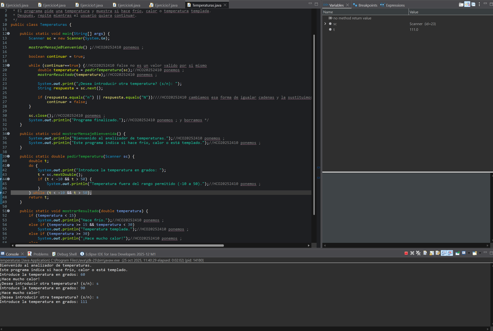

# PR-Eclipse-06-DepuracionYCorreccionErrores

## 1. Poner == en while para declarar true
Cometo un error poniendo continuar = true sin ==, por lo que mi while no funciona correctamente.  

---

## 2. Error en el if que provoca un bucle infinito  
En el if antes de acaba el while que es el que para el bucle, la condicion no está bien expresada por lo que el bucle nunca se para, lo solucionamos con equals, la forma óptima de comparar String.

---

## 3. Error en la limitacion de rango
Nuestro programa tiene la intención de parar cuando nuestra temperatura no está entre -10 y 50, pero esto no funciona, depurando no damos cuenta de que if y while que estaban destinados a realizar esto no actúan en ningún momento y esto es por culpa de la expresión que tienen en su interior. Cambiamos el AND por OR para que funcione.

---

## ¿Piensas que la documentación de un programa es necesaria? Justifica la respuesta  
Pienso que aunque ahora mismo como principiante no le vea mucho sentido cuando el programa escale de tamaño su utilidad creo que será increible. Tenemos que pensar que nosotros no somos los únicos que vamos a editar o ver el código y este tiene que tener una legibilidad que permita hacerlo correctamente, a la hora de presentarlo también tendremos que dar un mínimo de contexto y de explicaciones y no solo cientos de lineas de código sin explicación que, si despues genera errores, será muy difícil de gestionar.
Por lo que sí, pienso que la documentación seguramente pueda clasificarse como crucial en un proyecto serio y de grandes dimensiones.

